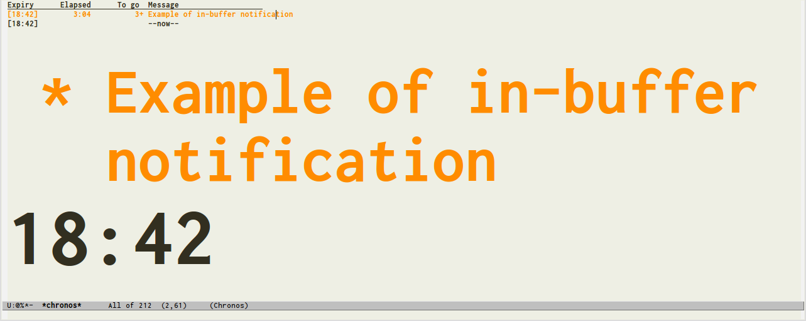

# Chronos

[](http://melpa.org/#/chronos)
[](http://www.gnu.org/licenses/quick-guide-gplv3.en.html)

## Whats New

Version 1.2 (Internal) allows entry of multiple cumulative timers, e.g. 'M-x
chronos-add-timers-from-string' `25/Pomodoro: Work on helm-chronos + 5/Pomodoro:
Rest` will add two timers: one to go off in 25 minutes and one to go off in 30
(=25+5).

Version 1.1 (Internal) has extra configuration options and a revamped
notification system using the hook `chronos-expiry-functions`.

If you are upgrading from v1.0, you might need to change your configurations if you referred to `chronos-shell-notify-command` (which has been split into `chronos-shell-notify-program` and a list of strings `chronos-shell-notify-parameters`) or `chronos-action-function` (which has become the hook `chronos-expiry-functions`).

Also, new notification methods have been added to:

* Play a wav file with Emacs' built in play-sound (requires Emacs to be built with sound support).
* Send a desktop notification (requires Emacs built with libnotify plus a system with dbus, consolekit and a notification daemon).
* Tell you when and what expired using a text to speech program (requires a program like espeak).

## Introduction

Chronos provides multiple countdown / countup timers, updated every
second, shown sorted by expiry time in the special buffer \*chronos\*.

   The \*chronos\* buffer might look like:

         Expiry      Elapsed      To go  Message
         [17:02]                         --now--
         [17:07]           9       4:51  Coffee

   In this example, the time 'now' is 17:02. A five minute countdown
timer was set up 9 seconds ago.  It is expected to expire in 4 minutes
51 seconds at 17:07.

Various notification methods are available.  Here is a picture of the in-buffer
notification method, which puts the message of an expired timer in the
`chronos-notification` face for `chronos-notification-time` seconds.



# Motivation

There are a number of Emacs packages that provide timer functionality, such as
job tracking, alarms or a countdown timer in the mode line.  However, I wanted
one that showed multiple simultaneous countdown and countup timers in a specific
buffer.

Possible use cases include:

* Cooking timers (what I use it for most often).
* Presentation timers (when to start wrapping up, when to start questions etc.).
* Timing how long something takes (on a scale of seconds to hours).

# Installation

## Old school

Put `chronos.el` somewhere Emacs can find it and evaluate:

     (require 'chronos)

## MELPA

If you have set up access to MELPA http://melpa.org/#/getting-started, you can
install using:

     M-x package-install chronos

## MELPA/use-package

If you have MELPA and `use-package` https://github.com/jwiegley/use-package,
you can install by evaluating:

     (use-package chronos :ensure t)

Add that snippet to your init file if you want chronos for future sessions.

## Quick start

`M-x chronos-add-timer` will start chronos and prompt you to add a timer.  When
prompted for the time, enter an integer number of minutes for the timer to count
down from (see later for more sophisticated options).  When prompted for the
message, enter a short description of the timer for display and notification.

Alternatively, you can use `M-x chronos-add-timers-from-string`.  This function
prompts for a string, from which one or more timers can be parsed.  See the
section [Add timers from string](#add-timers-from-string).

## Dependencies

Chronos should work on a stock Emacs install.

When a timer expires, various functions can be run to notify the user.  Some of
these can require particular builds of Emacs or system features.  See the
notifications section later.

## Enhancements

There is a helm interface for conveniently adding timers: `helm-chronos`.

See https://github.com/dxknight/helm-chronos

# Configuration

No configuration is required, but the defaults can be customized with
`M-x customize-group` chronos or set in your init file.

You may wish to bind `chronos-add-timer`, set the notification functions and
change the faces used in the chronos buffer.

# Expiry time specification

The expiry time specification can be absolute or relative.  Relative times are
with respect to a base time that, depending on circumstances, could be:

* current time, or
* the expiry time of another timer

## absolute time

Start with an `=`, followed by a 24+hr clock time.  For example, `=17:00` is an
expiry time of five o'clock in the afternoon.  Times are for the current day.
If you want to refer to times tomorrow (i.e. past midnight), add 24 hours:
e.g. `=25:30` specifies 1:30 tomorrow morning.

## relative time

Up to three numbers can be given, separated with colons `:`.  A minus
`-` can be prepended to indicate negative times.

   * No numbers (or all zeros) - the base time

   * One number - minutes

   * two numbers - hours and minutes and

   * three numbers - hours minutes and seconds.

Positive numbers indicate later expiry, negative ones earlier.

For example, if the base time is 17:00:
* `5` gives an expiry time of 17:05
* `1:30` gives 18:30
* `0:0:30` gives 30 seconds after 17:00
* empty or `0` gives a count up timer starting now, at 17:00.

Negative relative times are more useful against existing timers.  Here, a timer
was set for the absolute time 19:00, then with the cursor on this timer and
using `(C-u a)`, two relative timers were set to expire earlier, one with `-5`
(five minutes before end, i.e. 18:55) and the other with `-15` (fifteen
minutes before end, i.e. 18:45).

    Expiry      Elapsed      To go  Message 
    [18:04]                         --now--
    [18:45]          45      41:10  Any questions
    [18:55]          58      51:10  Thanks and goodbyes
    [19:00]        2:01      56:10  Talk ends

# Add timers from string

Although mainly useful for the `helm-chronos` helm interface,
`chronos-add-timers-from-string` parses a single string to set up one or more
consecutive timers.  If the first timer in the string has a relative expiry
time, this is relative to current time or, with the prefix argument, to the
currently selected timer.  Subsequent timers are relative to the previous timer
in the string.

The format of the string for a single timer is `<expiry specification>/<message>`.
You can delimit multiple consecutive timers with `+`.

For example, you could enter a pomodoro style timer with:

     25/Pomodoro: Work on helm-chronos + 5/Pomodoro: Rest

which will give a timer to go off in 25 minutes and another in 30 (=25+5)
minutes:

     Expiry      Elapsed      To go  Message
     [13:10]                         --now--
     [13:35]                  25:00  Pomodoro: Work on helm-chronos
     [13:40]                  30:00  Pomodoro: Rest

A more complex example might be

     =17:00/Drink coffee + -5/Brew coffee + -5/Boil kettle + 25/Finish break

Which will give a timer at 5 o'clock to drink coffee, a timer five minutes
before that (16:55) to start brewing the coffee, a reminder five minutes before
that (16:50) to put the kettle on and a reminder 25 minutes after that (17:15)
to finish drinking coffee and get back to work.

     Expiry      Elapsed      To go  Message
     [13:19]                         --now--
     [16:50]                3:30:46  Boil kettle
     [16:55]                3:35:46  Brew coffee
     [17:00]                3:40:46  Drink coffee
     [17:15]                3:55:46  Finish break

# Controls

In the \*chronos\* buffer, new timers can be added, selected, paused,
unpaused, lapped, adjusted or deleted.  Default keybindings in this
buffer are:

Key | Action
--- | ------------------------------------------------------------------------------------
a   | add a timer by specifying expiry time and a message
A   | add multiple consecutive timer(s) in one go
n/p | move selection down/up (also `C-n`/`C-p` `<down>`/`<up>`)
SPC | pause/unpause (pausing affects time to go and the expiry time, but not elapsed time)
d   | delete selected timer
D   | delete all expired timers
e   | edit selected timer
l   | lap selected timer
F   | freeze/unfreeze the display
q   | quit window

Whether relative times are against current time or the expiry time of the
selected timer is controlled by the prefix.

* Adding a timer with `a` is relative to current time; `(C-u a)` will
  calculate expiry times relative to the selected timer.

* Editing (adjusting) the selected timer with `e` will calculate times relative
  to the currently set expiry time of that timer.  `(C-u e)` will calculate
  relative times against the current time.

## Add a timer

Adding a timer with `a` in the \*chronos\* buffer is the same as adding
a timer with `M-x chronos-add-timer`.

Adding with `A` is the same as `M-x chronos-add-timers-from-string`.

## Move selection

A timer is selected when the cursor is on its line.  The cursor can be
moved down and up the timer list, wrapping as necessary, with `n` and
`p` (also `C-n`, `C-p`, `<down>` and `<up>`).

   The -now- timer can be selected, but cannot be paused, lapped or
deleted.

## Pause/Unpause

`SPC` pauses a running timer and unpauses a paused one.  Pausing a
timer halts the time to/since expiry and pushes back the expected
expiry time.  The time elapsed since setting up the timer continues to
increase.  The timer is displayed in the `chronos-paused` face

## Deleting timers

The selected timer can be deleted with `d`.  Alternatively, all
expired timers can be deleted with `D`.  Once deleted, they're gone.

## Editing timers

When editing a timer, you will be prompted for an expiry time specification like
used when adding a new timer.  If the edit is started with `e`, the new expiry
time will be calculated relative to the timer's existing expiry time.  If the
edit is called with a prefix `C-u e`, the new expiry time will be relative to
the current time.

   You will also be prompted for a message, using the existing
message as a starting point.

## Lap timers

When a timer is lapped by pressing `l`:
   * The timer is paused and the time that had elapsed until the timer was
     lapped is appended to the message.  If the message does not already include
     a lap number, `<1>` is inserted in the message.

   * A new timer with the message `<n+1>` is run continuing on from the one just
     lapped.

### Lap example

   For example, a countup timer was set with Time:0 and Message:Lap
timer example.

   After running for six seconds, the timer was lapped with `l`.
Eight seconds later, the timer was lapped again, then after five
seconds and then four.  These lap times, together with lap numbers in
`<>` were appended to the messages.  There is no lap time for lap 5, as
that timer hasn't been lapped yet.

   The 'To go' column gives the total elapsed time, e.g. the first
four laps took 23 seconds.

   The Elapsed column gives how long since the lap started - e.g. lap
2 started 24 seconds ago.

     Expiry      Elapsed      To go  Message
     [11:50]           7         30+ Lap timer example <5>
     [11:50]          11         23+ Lap timer example <4>       4
     [11:50]          17         19+ Lap timer example <3>       5
     [11:50]          24         14+ Lap timer example <2>       8
     [11:51]          30          6+ Lap timer example <1>       6
     [11:51]                         --now--

## Freezing the display

Freezing the display with `F` prevents any updates to the \*chronos\* buffer or
triggering of expiry actions, but does not stop the timers running.  Unfreezing
the display with `F` again updates the \*chronos\* buffer to current values and
triggers all outstanding actions.

## Quitting, Killing and restarting

Quitting with `q` buries the \*chronos\* buffer, but timers continue to
run.  Switch back to the \*chronos\* buffer when required.

Killing the \*chronos\* buffer in the usual way (typically `C-x k`) deletes any
timers (after user confirmation) and closes the buffer.  To restart after a
kill, use `M-x chronos-add-timer`.


# Notifications

By default, expired timers are shown above the -now- line, highlit
with the `chronos-expired` face, until they are deleted.  Additional
actions can be set for when a timer expires by adding functions to the hook
`chronos-expiry-functions`.

Countup timers (those started with 0 time to expire) do not
trigger these notifications, although they are highlit with the
`chronos-expired` face.

   If an unexpired timer is edited so that its expiry time is now in
the past, no notification will be triggered.  Conversely, adjusting
an expired timer so that its expiry time is now in the future will
trigger any notifications when the timer expires.

## chronos-expiry-functions

The hook `chronos-expiry-functions` is empty by default so it can be set
directly as a list of functions, or `add-hook` can be used to add functions to
it in the standard way.

This hook is "abnormal", in that all functions added must take an argument: the
expired timer.

Standard functions available are:

Function | Action
---------|------------------
chronos-message-notify | Issues a message to the echo area and \*Messages\* buffer
chronos-sound-notify   | Plays `chronos-notification-wav` (if Emacs compiled with sound support and the specified wav file exists).
chronos-desktop-notifications-notify | Sends a desktop notification (if Emacs compiled with libnotify support and running in a dbus / consolekit / notification environment).
chronos-buffer-notify |  Displays the timer's message in the \*chronos\* buffer, in the`chronos-notification` face for `chronos-notification-time` seconds.
chronos-shell-notify  | Runs `chronos-shell-notify-program` (if it exists) with parameters `chronos-shell-notify-parameters`.
chronos-dunstify      | Uses the `dunst` notification daemon (requires dunst and dbus but not consolekit).
chronos-text-to-speech-notify | Uses `chronos-text-to-speech-program` (such as espeak) with `chronos-text-to-speech-program-parameters` to speak the expiry time and message.

For example, in my init file I have:
```elisp
    (setq chronos-shell-notify-program "mpv"
          chronos-shell-notify-parameters '("--really-quiet"
                                            "--af=scaletempo=speed=pitch"
                                            "--speed=0.65"
                                            "~/wip/progs/cdt/temple-bell-zen.mp3")
          chronos-text-to-speech-program "espeak"
          chronos-text-to-speech-program-parameters "-s 100"
          chronos-expiry-functions '(chronos-dunstify
                                     chronos-buffer-notify
                                     chronos-shell-notify
                                     chronos-text-to-speech-notify))
```

This sets the notification sequence to pop up a dunst notification, put the
message in the \*chronos\* buffer in big text, run `mpv` in the shell with
various parameters to give a slowed down temple bell and then speak the time and
message with `espeak`.
